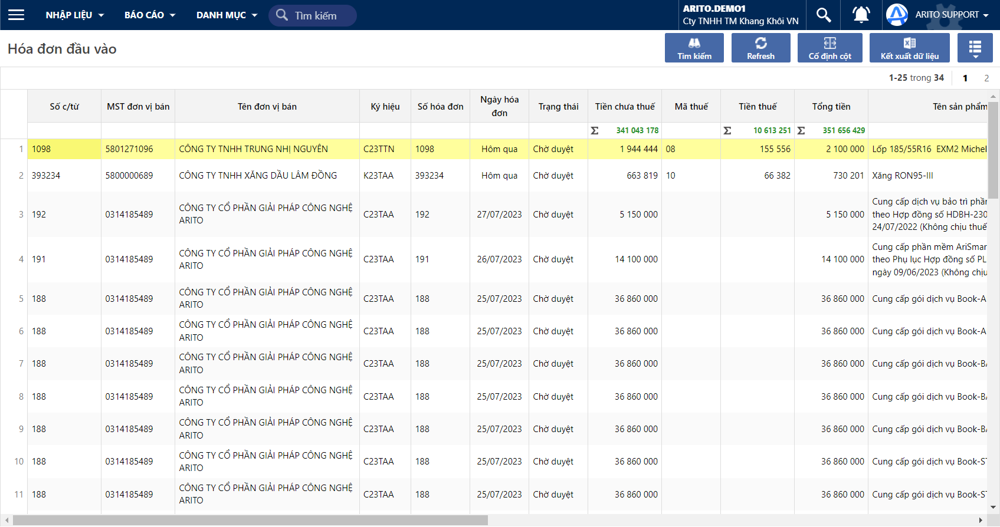
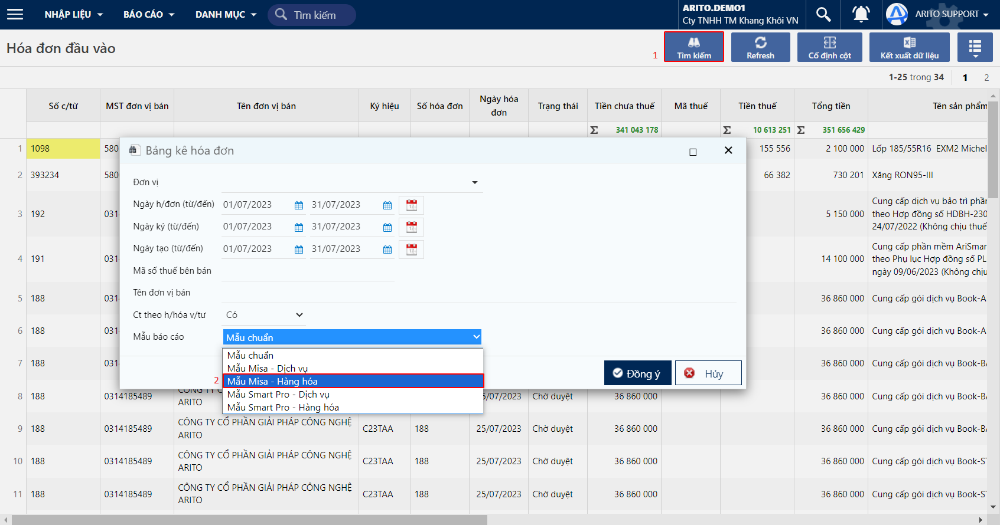

---
layout:
  title:
    visible: true
  description:
    visible: false
  tableOfContents:
    visible: true
  outline:
    visible: true
  pagination:
    visible: false
---

# Bảng kê hoá đơn đầu vào

* Xem thống kê các hoá đơn đầu vào trong khoảng thời gian xác định
* Dùng để import mẫu excel vào nhiều hệ thống khác nhau

## Các bước thao tác

### Xem bảng kê chi tiết hoá đơn đầu vào

**Bước 1:** Tại màn hình lọc báo cáo: Chọn Mẫu báo cáo: Mẫu chuẩn

Đường dẫn: _**Hoá đơn đầu vào/ Bảng kê hoá đơn**_

.png>)

**Bước 2:** Xem báo cáo

<figure><figcaption>
Bảng kê hoá đơn đầu vào
</figcaption></figure>

### Xuất mẫu excel để import vào phần mềm kế toán khác

Ví dụ: Import mẫu báo cáo excel vào phần mềm Misa

**Bước 1:** Tại màn hình điều kiện lọc - chọn mẫu Misa - hàng hoá hoặc mẫu Misa - Dịch vụ

<figure><figcaption></figcaption></figure>

**Bước 2:** Tại màn hình báo cáo, nhấp vào nút Kết xuất dữ liệu

.png>)

**Bước 3:** Dùng mẫu excel vừa được tải về, import vào phần mềm Misa
