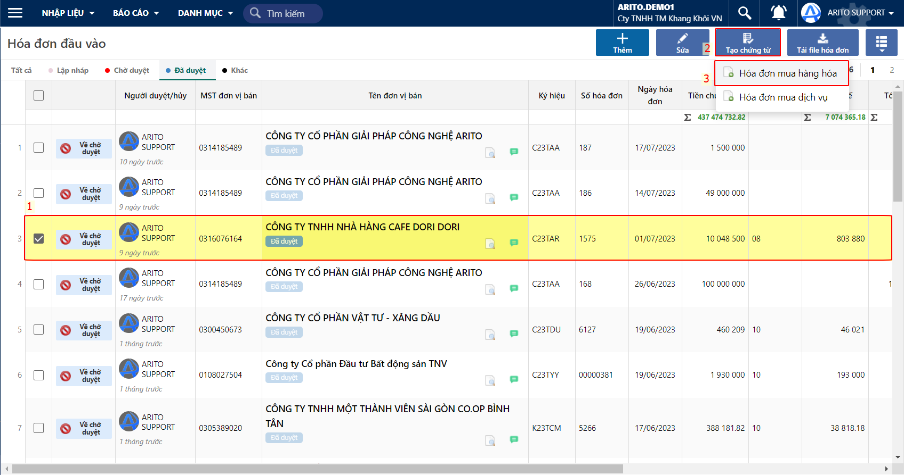
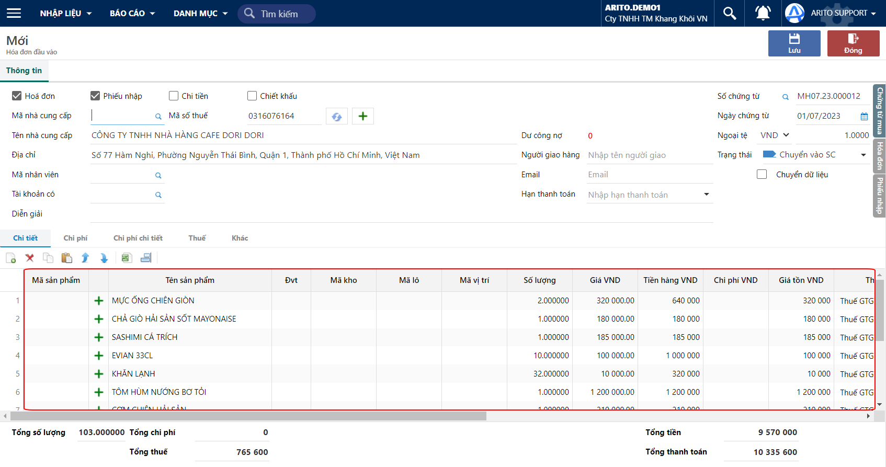
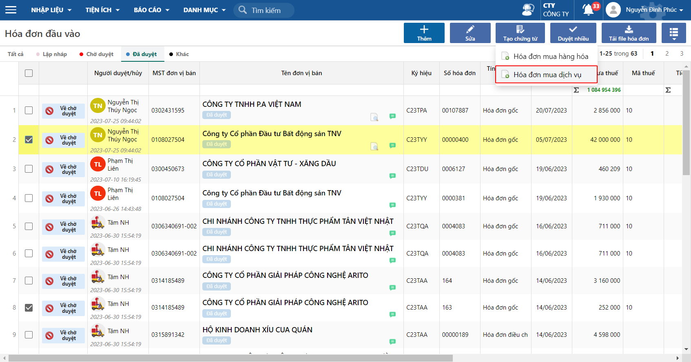
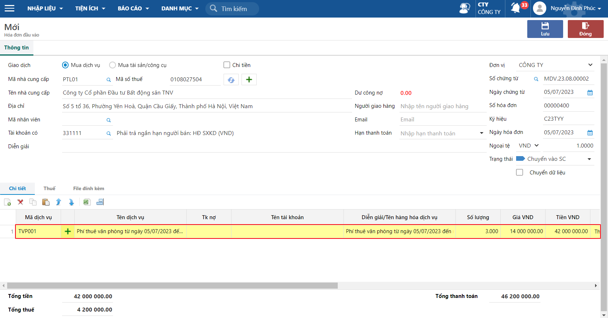

---
layout:
  title:
    visible: true
  description:
    visible: false
  tableOfContents:
    visible: true
  outline:
    visible: true
  pagination:
    visible: false
---

# Cách tạo chứng từ kế toán từ Hoá đơn đầu vào

Tạo chứng từ kế toán (hoá đơn mua hàng trong nước, hoá đơn mua dịch vụ) để hạch toán và ghi sổ; phục vụ cho việc kê khai và lập bảng kê hoá đơn mua vào.

Các mục đích chính của việc tạo chứng từ kế toán từ hoá đơn đầu vào bao gồm:

* Kê khai hoá đơn đầu vào
* Hạch toán kế toán các hoá đơn hợp lệ

## Các bước thực hiện

#### Trường hợp 1: Tạo hoá đơn mua hàng hoá

**Bước 1:** Chọn phiếu và nhấn **Tạo chứng từ,** chọn **Hoá đơn mua hàng hoá.**

<figure><figcaption>
Tạo hoá đơn mua hàng mua hàng
</figcaption></figure>

**Bước 2**: Tại màn hình Hoá đơn mua hàng hoá, kiểm tra các thông tin được tạo tự động và thêm các thông tin cần theo dõi.

<figure><figcaption>
Hoá đơn mua hàng hoá
</figcaption></figure>

**Một số lưu ý:**

* Nếu mã số thuế người bán đã tồn tại trong danh mục nhà cung cấp, chương trình sẽ load tự động các thông tin mã nhà cung cấp, tên nhà cung cấp, địa chỉ theo thông tin khai báo trong danh mục nhà cung cấp.
* Nếu mã số thuế người bán chưa tồn tại trong danh mục nhà cung cấp, người dùng cần nhấn vào biểu tượng  (1) (1).png>) để thêm mới thông tin nhà cung cấp, xem hướng dẫn thêm mới nhà cung cấp [tại đây.](https://app.gitbook.com/s/bydpvJ6g68FMDkXOSzVB/bat-dau-s-dung/thiet-lap-danh-muc/danh-muc-nha-cung-cap)
* Nếu tên sản phẩm đã tồn tại trong danh mục vật tư, chương trình sẽ lấy tự động mã vật tư, tên vật tư, đơn vị tính, ... theo thông tin đã khai báo trong danh mục vật tư.
* Nếu tên sản phẩm chưa tồn tại trong danh mục vật tư, người dùng cần nhấn vào biểu tượng  (1) (1).png>) để thêm mới thông tin vật tư, xem hướng dẫn thêm mới vật tư [tại đây.](https://app.gitbook.com/s/bydpvJ6g68FMDkXOSzVB/bat-dau-s-dung/thiet-lap-danh-muc/danh-muc-vat-tu-san-pham)

#### Trường hợp 2: Tạo hoá đơn mua dịch vụ

**Bước 1:** Chọn phiếu và tạo chứng từ Hoá đơn mua dịch vụ

<figure><figcaption>
Hoá đơn đầu vào
</figcaption></figure>

**Bước 2:** Tại màn hình Hoá đơn mua dịch vụ, kiểm tra các thông tin được tạo tự động và thêm các thông tin cần theo dõi

<figure><figcaption>
Hoá đơn mua dịch vụ
</figcaption></figure>

**Một số lưu ý:**

* Nếu tên dịch vụ đã tồn tại trong danh mục dịch vụ, chương trình sẽ lấy tự động mã dịch vụ, tên dịch vụ, đơn vị tính, tài khoản có ... theo thông tin đã khai báo trong danh mục dịch vụ.
* Nếu tên dịch vụ chưa tồn tại trong danh mục dịch vụ, người dùng cần nhấn vào biểu tượng  (1) (1).png>) để thêm mới thông tin dịch vụ.
