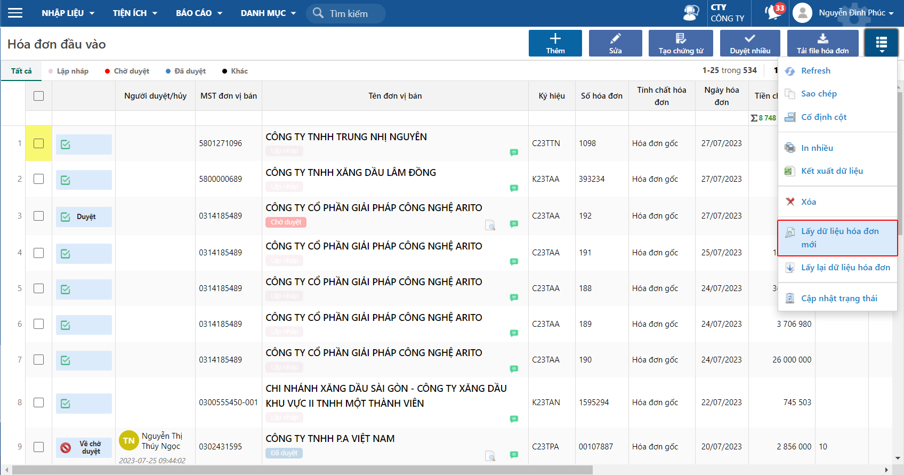
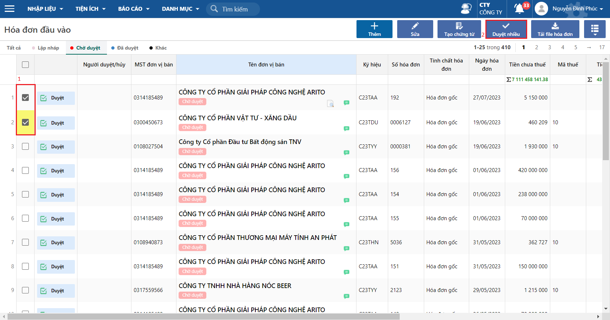
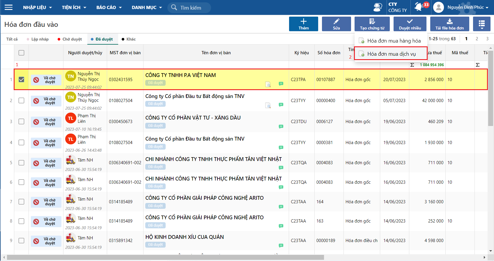
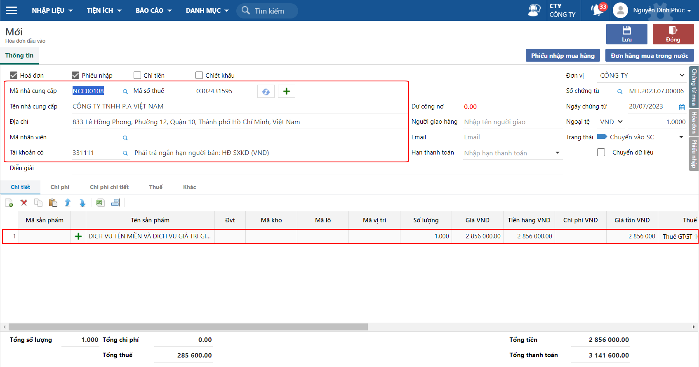

---
layout:
  title:
    visible: true
  description:
    visible: false
  tableOfContents:
    visible: true
  outline:
    visible: true
  pagination:
    visible: false
---

# Giải pháp Hoá đơn đầu vào cho ERP

* Giúp tiết kiệm thời gian và chi phí của công ty
* Lấy dữ liệu từ HĐĐV giúp giảm thiếu sai sót và tăng hiệu quả làm việc

## Các bước thao tác

**Bước 1:** Lấy dữ liệu hoá đơn mới

Đường dẫn: _**Tài chính**_**/ \_Mua hàng**_\*\*/ \*\*_**Tiện ích/ Hoá đơn đầu vào**\_

<figure><figcaption>
Lấy hoá đơn mới
</figcaption></figure>

**Bước 2:** Kiểm tra và Duyệt các hoá đơn đầu vào

Ở màn hình này, có thể duyệt một phiếu hoặc nhiều hoá đơn.

<figure><figcaption>
Duyệt Hoá đơn đầu vào
</figcaption></figure>

**Bước 3:** Tại các phiếu đã được Duyệt, chọn vào Tạo chứng từ Hoá đơn mua hàng hoá hoặc Hoá đơn mua dịch vụ

<figure><figcaption>
Tạo Hoá đơn mua dịch vụ
</figcaption></figure>

**Bước 4:** Kiểm tra Hoá đơn mua dịch vụ được thêm mới

<figure><figcaption></figcaption></figure>
