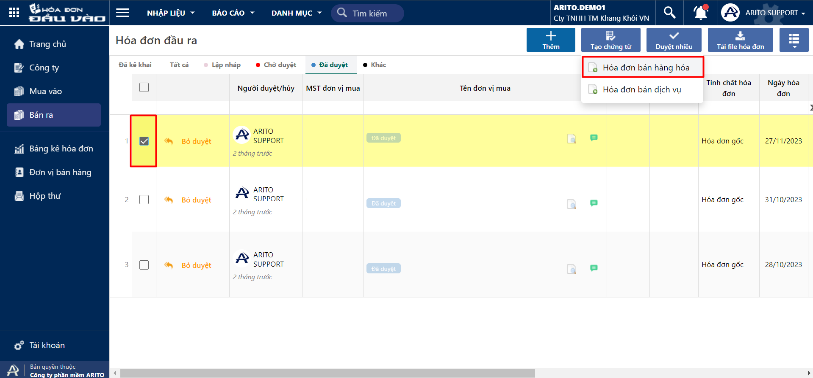

# Tạo chứng từ

Tạo chứng từ kế toán (hoá đơn bán hàng hoá, hoá đơn bán dịch vụ) để hạch toán doanh thu bán hàng,  phục vụ cho việc kê khai và lập bảng kê hoá đơn bán ra.

Các mục đích chính của việc tạo chứng từ kế toán từ hoá đơn bán ra bao gồm:

* Kê khai hoá đơn bán ra.
* Hạch toán kế toán các hoá đơn hợp lệ.

## Các bước thực hiện

### Trường hợp 1: Hoá đơn bán hàng hoá

**Bước 1:** Chọn phiếu và nhấn **Tạo chứng từ,** chọn **Hoá đơn bán hàng hoá.**

<figure><figcaption></figcaption></figure>

**Bước 2**: Tại màn hình Hoá đơn mua hàng hoá, kiểm tra các thông tin được tạo tự động và thêm các thông tin cần theo dõi.

<figure><figcaption></figcaption></figure>

**Một số lưu ý:**

* Nếu mã số thuế người mua đã tồn tại trong danh mục khách hàng, chương trình sẽ load tự động các thông tin mã khách hàng, tên khách hàng, địa chỉ theo thông tin khai báo trong danh mục khách hàng.
* Nếu mã số thuế người mua chưa tồn tại trong danh mục khách hàng, người dùng cần nhấn vào biểu tượng  để thêm mới thông tin khách hàng.
* Nếu tên sản phẩm đã tồn tại trong danh mục vật tư, chương trình sẽ lấy tự động mã sản phẩm, tên sản phẩm, đơn vị tính, ... theo thông tin đã khai báo trong danh mục vật tư.
* Nếu tên sản phẩm chưa tồn tại trong danh mục vật tư, người dùng cần nhấn vào biểu tượng  để thêm mới thông tin sản phẩm.

### Trường hợp 2: Tạo hoá đơn bán dịch vụ

**Bước 1:** Chọn phiếu và tạo chứng từ Hoá đơn bán dịch vụ.

<figure><figcaption></figcaption></figure>

**Bước 2:** Tại màn hình Hoá đơn bán dịch vụ, kiểm tra các thông tin được tạo tự động và thêm các thông tin cần theo dõi.

<figure><figcaption></figcaption></figure>

**Một số lưu ý:**

* Nếu tên dịch vụ đã tồn tại trong danh mục dịch vụ, chương trình sẽ lấy tự động mã dịch vụ, tên dịch vụ, đơn vị tính, tài khoản có ... theo thông tin đã khai báo trong danh mục dịch vụ.
* Nếu tên dịch vụ chưa tồn tại trong danh mục dịch vụ, người dùng cần nhấn vào biểu tượng  để thêm mới thông tin dịch vụ.
