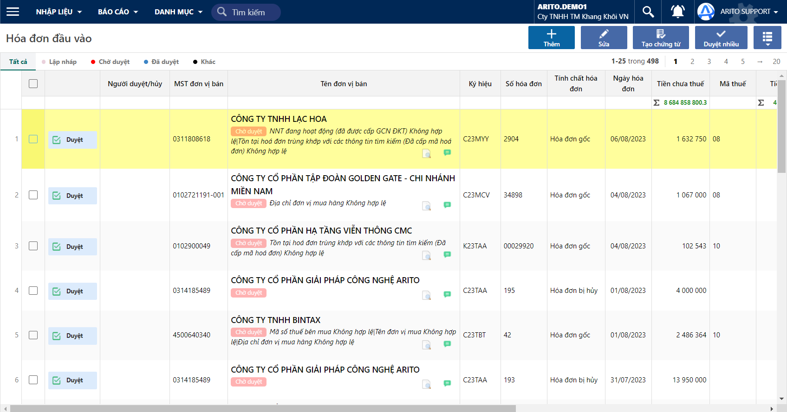

---
layout:
  title:
    visible: true
  description:
    visible: false
  tableOfContents:
    visible: true
  outline:
    visible: true
  pagination:
    visible: false
---

# Lấy dữ liệu hóa đơn đầu vào

* Lấy và đọc toàn bộ hoá đơn đầu vào của doanh nghiệp, giúp tự động hóa quy trình nhập liệu và giảm thiểu sai sót do nhập liệu thủ công.
* Chuyển đổi các thông tin của hoá đơn đầu vào dưới định dạng XML và hiển thị lên màn hình nhập liệu.
* Hiển thị mẫu in của hoá đơn điện tử.

## Các bước thực hiện

Chương trình tự động lấy hoá đơn từ hộp mail (hoặc từ Tổng cục thuế) về tại màn hình _**Mua vào**_.

Các hoá đơn mới được cập nhật sẽ có trạng thái **Lập nháp**.

<figure><figcaption></figcaption></figure>

Trường hợp chương trình chưa kịp cập nhật tự động hoá đơn thì người dùng có thể lấy ngay hoá đơn về bằng cách nhấn **Lấy dữ liệu hoá đơn mới.**

.png>)

.png>)
