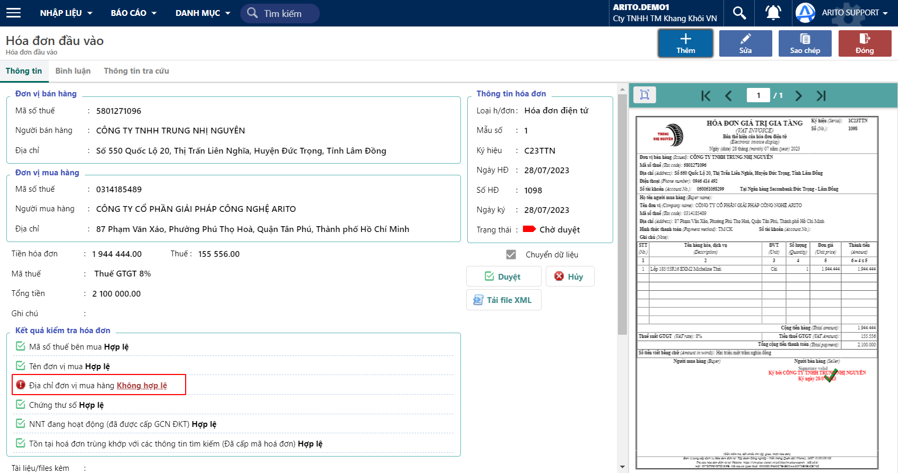
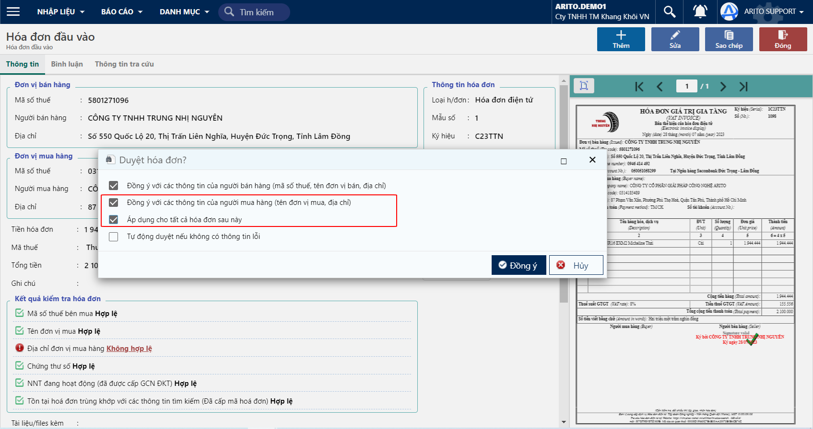

---
layout:
  title:
    visible: true
  description:
    visible: false
  tableOfContents:
    visible: true
  outline:
    visible: true
  pagination:
    visible: false
---

# Duyệt tên đơn vị, địa chỉ để áp dụng cho các hoá đơn sau

Chức năng này cho phép người dùng xét duyệt tên đơn vị, địa chỉ của người mua trong trường hợp tên đơn vị (hoặc địa chỉ) trên hoá đơn khác với tên đơn vị (hoặc địa chỉ) đăng ký với cơ quan thuế. Người dùng có thể chọn áp dụng tính hợp lệ của tên đơn vị (hoặc địa chỉ) đã được duyệt cho tất cả các hoá đơn phát sinh sau này.

## Các bước thực hiện

**Bước 1:** Kiểm tra tính hợp lệ của hoá đơn theo đường dẫn _**Mua vào,**_ nhấn vào MST người bán hoặc Tên đơn vị bán để xem **kết quả kiểm tra hoá đơn**.

Chức năng này được áp dụng đối với các hoá đơn đầu vào có kết quả kiểm tra là **Địa chỉ đơn vị mua hàng (Hoặc Tên đơn vị mua)**: **Không hợp lệ**

<figure><figcaption>
Màn hình chứng từ
</figcaption></figure>

**Bước 2:** Nhấn **Duyệt**, chương trình sẽ tự động bung lên các lựa chọn và chọn 2 nút

* Đồng ý với các thông tin của người mua hàng (tên đơn vị mua, địa chỉ)
* Áp dụng cho tất cả hoá đơn sau này

<figure><figcaption>
Màn hình duyệt
</figcaption></figure>

**Bước 3:** Xem kết quả duyệt hoá đơn.

Sau khi duyệt hoá đơn, trạng thái của hoá đơn được cập nhật về **Đã duyệt** và kết quả kiểm tra Tên đơn vị mua (hoặc địa chỉ người mua) cập nhật **Hợp lệ**.

<figure><figcaption>
Kết quả kiểm tra hoá đơn
</figcaption></figure>

Các hoá đơn phát sinh sau này sẽ được đánh dấu Hợp lệ đối với tên người mua hàng (hoặc địa chỉ mua hàng) đã được duyệt.
