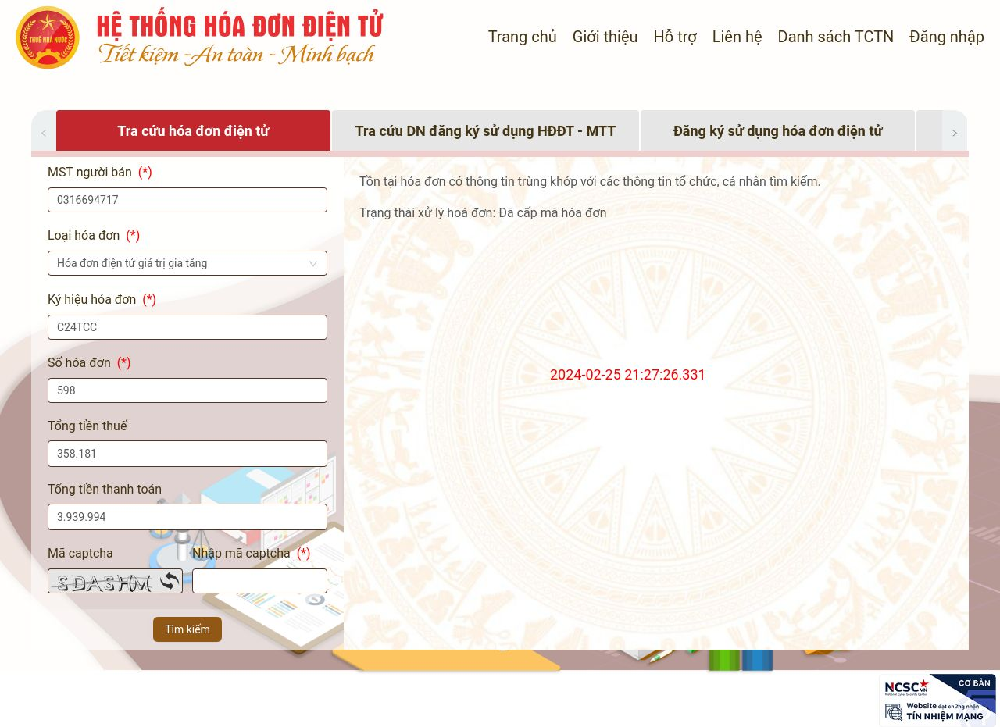

---
layout:
  title:
    visible: true
  description:
    visible: false
  tableOfContents:
    visible: true
  outline:
    visible: true
  pagination:
    visible: false
---

# Kiểm tra tính hợp lệ

Chương trình tự động kiểm tra tính hợp lệ của thông tin người bán, thông tin người mua trên hoá đơn với thông tin doanh nghiệp đăng ký với cơ quan thuế.

**Bước 1:** Sau khi các hoá đơn mới sẽ được đẩy vào tự động ở trạng thái **Lập nháp,** người dùng chọn cập nhật trạng thái để đưa hoá đơn về trạng thái **Chờ duyệt.**

Đường dẫn: _**Mua vào**_

<figure><figcaption>
Cập nhật trạng thái
</figcaption></figure>

**Bước 2:** Nhấp vào **MST đơn vị bán** hoặc **tên đơn vị bán** để xem kết quả kiểm tra hoá đơn hợp lệ.

<figure><figcaption>
Hoá đơn đầu vào
</figcaption></figure>

Xem kết quả kiểm tra tính hợp lệ của hoá đơn tại ô Kết quả kiểm tra hoá đơn.

<figure><figcaption>
Xem kết quả kiểm tra hoá đơn
</figcaption></figure>

**Bước 3:** Nhấp vào Tab Thông tin tra cứu

Hệ thống tự động trả thông tin kiểm tra hóa đơn với trang Tổng Cục thuế về Phần mềm.&#x20;

Bấm vào tính năng **Tra cứu lại** trường hợp Phần mềm chưa trả đủ 2 hình.  &#x20;

<figure><figcaption>
Thông tin tra cứu từng hóa đơn và hình chụp
</figcaption></figure>

<figure><figcaption>
Thông tin tra cứu tình trạng NNT và hình chụp
</figcaption></figure>

