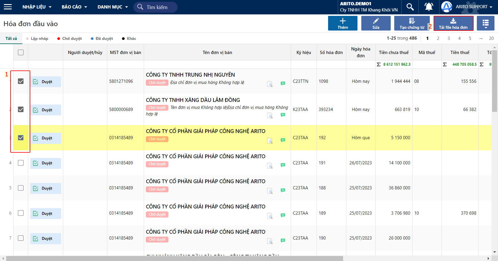
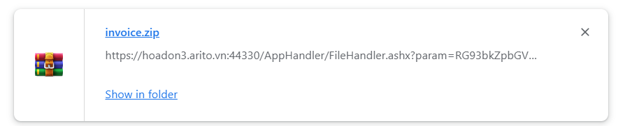
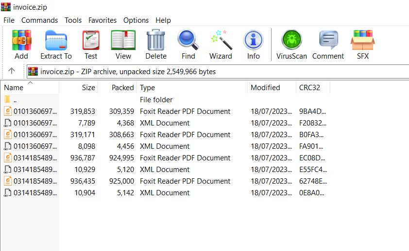

---
layout:
  title:
    visible: true
  description:
    visible: false
  tableOfContents:
    visible: true
  outline:
    visible: true
  pagination:
    visible: false
---

# Tải XML và PDF của hoá đơn

Dùng để tải xuống file XML và PDF của hoá đơn, phục vụ cho nhu cầu lưu trữ của người dùng.

## Các bước thực hiện

**Bước 1:** Chọn một hoặc nhiều hoá đơn để tải -> chọn Tải file hoá đơn

<figure><figcaption>
Tải file hoá đơn
</figcaption></figure>

**Bước 2:** Kiểm tra và mở file .zip được tải về

<figure><figcaption></figcaption></figure>

**Bước 3:** Mở file zip và kiểm tra file XML và mẫu PDF của hoá đơn

<figure><figcaption>
File XML và mẫu in PDF của hoá đơn
</figcaption></figure>
