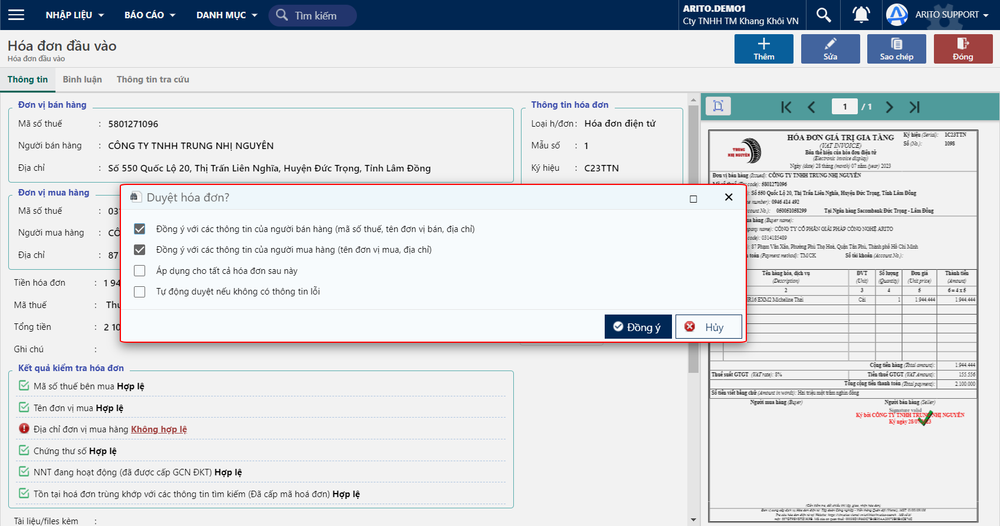
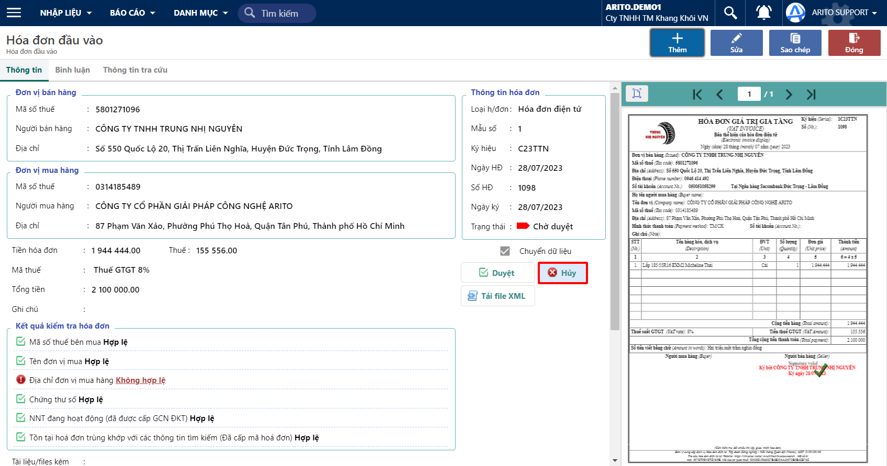

---
layout:
  title:
    visible: true
  description:
    visible: false
  tableOfContents:
    visible: true
  outline:
    visible: true
  pagination:
    visible: false
---

# Xét duyệt hoá đơn

Kế toán xét duyệt các hoá đơn đầu vào bằng thao tác duyệt hoá đơn. Các hoá đơn hợp lệ sẽ được duyệt, từ đó là cơ sở để hạch toán kế toán và kê khai bảng kê thuế đầu vào. Ngược lại, các hoá đơn không hợp lệ sẽ bị huỷ duyệt.

## Duyệt hoá đơn

#### Có 2 cách duyệt Hoá đơn đầu vào

**Cách 1:** Duyệt tại màn hình chính (Tab tất cả hoặc Tab Chờ duyệt)

<figure><figcaption>
Màn hình duyệt
</figcaption></figure>

**Cách 2:** Duyệt tại phiếu

Chọn phiếu muốn Duyệt và nhấp vào ô Duyệt trên chứng từ.

<figure><figcaption>
Duyệt tại phiếu
</figcaption></figure>

Sau khi nhấp nút Duyệt, thì mành hình sẽ bung lên các thông tin sau:

* Đồng ý với các thông tin của người bán hàng, mã số thuế, tên đơn vị bán, địa chỉ: đồng ý với các thông tin trong mục Đơn vị bán hàng.
* Đồng ý với các thông tin của người mua hàng (tên đơn vị mua, địa chỉ): đồng ý với các thông tin trong mục Đơn vị mua hàng.
* Áp dụng cho tất cả hoá đơn sau này: dùng trong trường hợp địa chỉ bán hàng khác với địa chỉ đăng ký kinh doanh.
* Tự động duyệt nếu không có thông tin lỗi: dùng trong trường hợp hệ thống tự động kiểm tra hoá đơn đầu vào (trong mục Kết quả kiểm tra hoá đơn), nếu hợp lệ tất cả các mục thì Hoá đơn đầu vào được tự động duyệt.

<figure><figcaption></figcaption></figure>

Sau khi duyệt, hoá đơn đầu vào được chuyển trạng thái Đã duyệt.

## Huỷ hoá đơn

Trường hợp kiểm tra hoá đơn đầu vào không hợp lệ, người dùng có thể Huỷ hoá đơn ngay tại phiếu.

<figure><figcaption>
Huỷ hoá đơn
</figcaption></figure>
